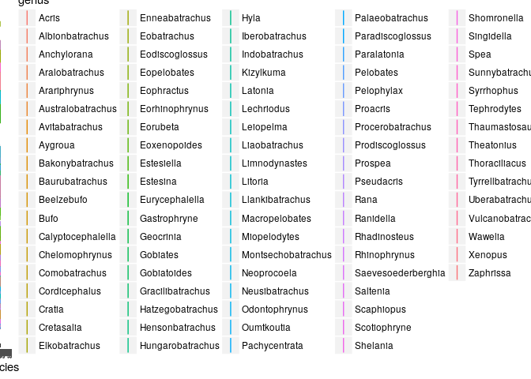
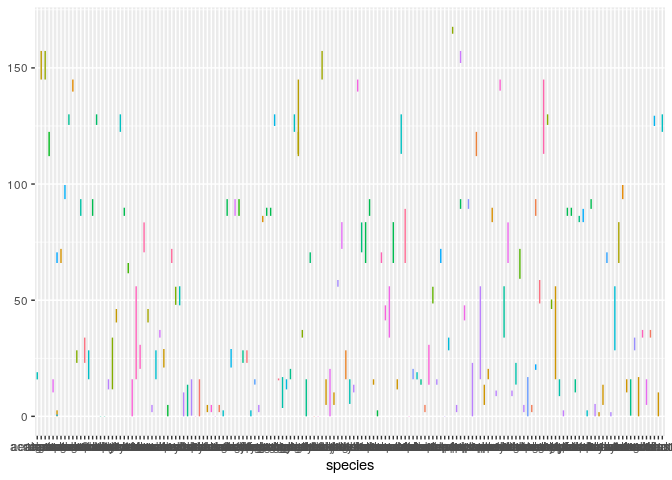
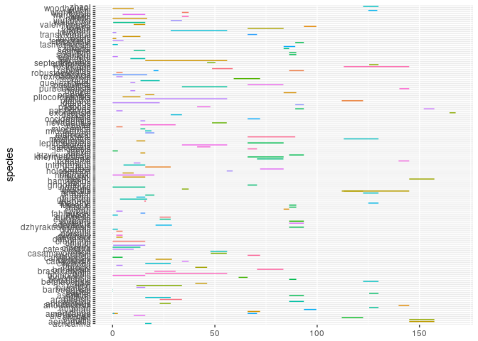
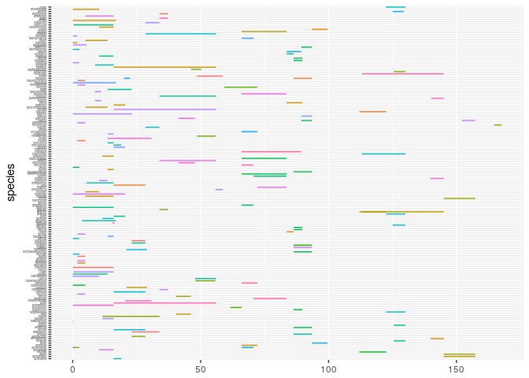
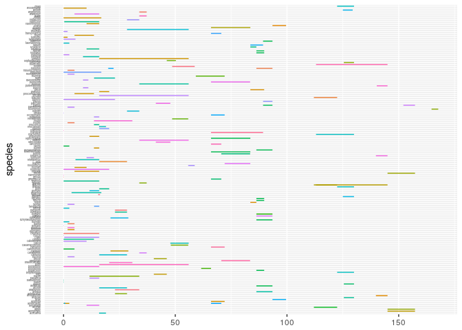
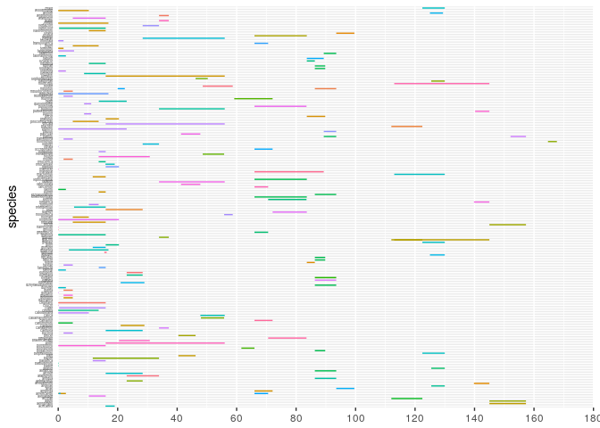
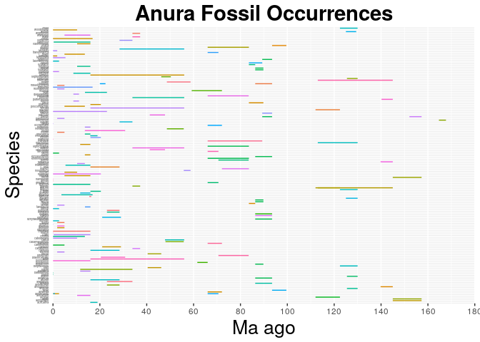

    library(ggplot2)

The data set below contains information about the first and last appearance for each unique species in the family Canidae that is represented in the PBDB:
==========================================================================================================================================================

    frogs <- read.csv("/home/eeb177-student/Desktop/eeb-177/final-project/formatted-week-9-frog-data.csv", header = F, as.is = T)

    names(frogs) <- c("genus", "species", "minage", "maxage")

    head(frogs)

    ##            genus    species minage maxage
    ## 1 Eodiscoglossus oxoniensis  164.7  167.7
    ## 2  Comobatrachus aenigmatis  145.0  157.3
    ## 3 Enneabatrachus     hechti  145.0  157.3
    ## 4    Eobatrachus     agilis  145.0  157.3
    ## 5   Rhadinosteus     parvus  152.1  157.3
    ## 6  Cordicephalus   gracilis  113.0  145.0

    View(frogs)

    frogs_occ <- ggplot(frogs, aes( species, ymin = maxage, ymax=minage, colour = genus))

    frogs_occ <- frogs_occ + geom_linerange()
    frogs_occ

\# Removing legend:

    frogs_occ <- frogs_occ + theme(legend.position="none")

    frogs_occ

\# Flip the axis:

    frogs_occ <- frogs_occ + coord_flip()

    frogs_occ

\# Making species a bit smaller so they can be more readable:

    frogs_occ <- frogs_occ +  theme(axis.text.y = element_text(size=3))

    frogs_occ

Getting rid of the tick marks on the y axis:
============================================

    frogs_occ <- frogs_occ + theme(axis.ticks.y=element_blank())

    frogs_occ

\# Now, I will work a bit with the x-axis:

    frogs_occ <- frogs_occ + scale_y_continuous(limits=c(0, 180), expand = c(0, 0), breaks=c(0, 20, 40, 60, 80, 100, 120, 140, 160, 180))

    frogs_occ

Adding titles:
==============

    frogs_occ <- frogs_occ + labs(title = "Anura Fossil Occurrences", x = "Species", y = "Ma ago") + theme(plot.title = element_text(hjust = 0.5, size=22, face = "bold"), axis.title =element_text(size=20))
    frogs_occ

