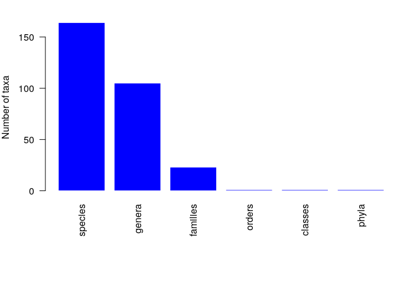
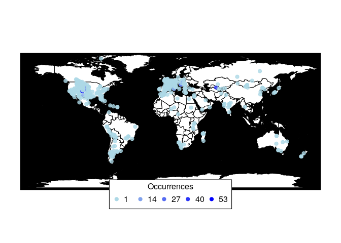
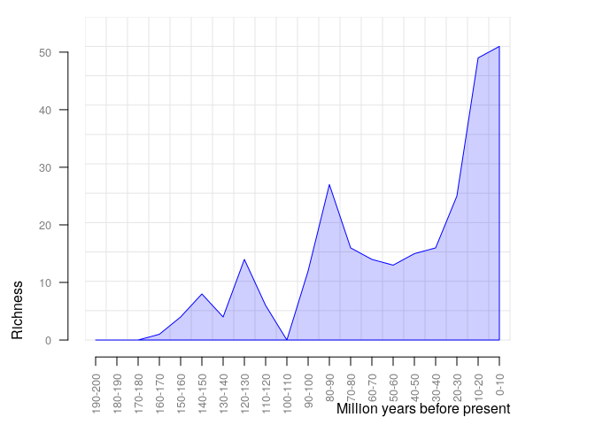
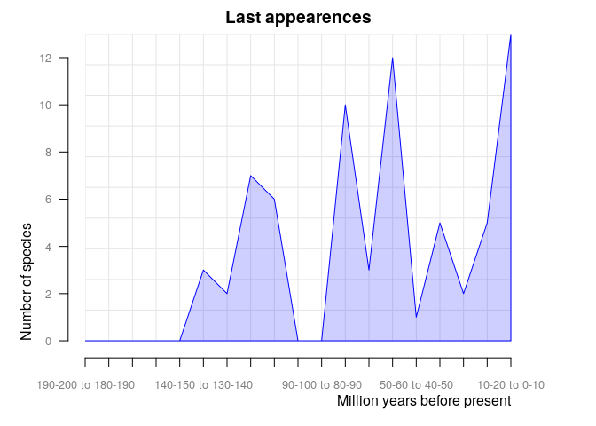

    #install.packages("paleobioDB")
    library(paleobioDB)

    ## Loading required package: raster

    ## Loading required package: sp

    ## Loading required package: maps

    #install.packages("devtools")
    library(devtools)
    #install_github("ropensci/paleobioDB")
    library(paleobioDB)

Defining "Anura"= frogs:
========================

Give me a list of occurences and names:
=======================================

    frogs <-pbdb_occurrences (limit="all", vocab= "pbdb", base_name="Anura", show=c("coords", "phylo", "ident"))
    head(frogs)

    ##     occurrence_no record_type collection_no
    ## 1:1        137378  occurrence         11576
    ## 1:2        137379  occurrence         11576
    ## 1:3        137433  occurrence         11582
    ## 1:4        138862  occurrence         11806
    ## 1:5        138866  occurrence         22634
    ## 1:6        145954  occurrence         12816
    ##                                taxon_name taxon_rank taxon_no
    ## 1:1     Cretasalia n. gen. tsybini n. sp.    species   134552
    ## 1:2                Gobiates leptocolaptus    species    58445
    ## 1:3 Gobiates n. gen. khermeentsavi n. sp.    species   156388
    ## 1:4                          Anura indet.      order    37422
    ## 1:5                        Pipidae indet.     family    37435
    ## 1:6  Enneabatrachus n. gen. hechti n. sp.    species    53192
    ##               matched_name matched_rank matched_no early_interval
    ## 1:1     Cretasalia tsybini      species     134552      Campanian
    ## 1:2 Gobiates leptocolaptus      species      58445      Campanian
    ## 1:3 Gobiates khermeentsavi      species     156388      Campanian
    ## 1:4                  Anura        order     150288     Berriasian
    ## 1:5                Pipidae       family      37435     Berriasian
    ## 1:6  Enneabatrachus hechti      species      53192   Kimmeridgian
    ##     late_interval early_age late_age reference_no        lng      lat
    ## 1:1 Maastrichtian      83.6     66.0    4173;4173   99.60000 43.30000
    ## 1:2 Maastrichtian      83.6     66.0    4173;4173   99.60000 43.30000
    ## 1:3 Maastrichtian      83.6     66.0  30994;30994   99.60000 43.30000
    ## 1:4   Valanginian     145.0    132.9    4203;4203   35.20000 31.00000
    ## 1:5        Aptian     145.0    113.0    4203;4203   34.72666 30.53889
    ## 1:6     Tithonian     157.3    145.0    4280;4280 -106.00222 41.89305
    ##              genus genus_no         family family_no order order_no
    ## 1:1     Cretasalia    86719     Gobiatidae     86720 Anura    97112
    ## 1:2       Gobiates    37429     Gobiatidae     86720 Anura    97112
    ## 1:3       Gobiates    37429     Gobiatidae     86720 Anura    97112
    ## 1:4           <NA>       NA           <NA>        NA Anura    97112
    ## 1:5           <NA>       NA        Pipidae     37435 Anura    97112
    ## 1:6 Enneabatrachus    53191 Discoglossidae     37426 Anura    97112
    ##        class class_no   phylum phylum_no     genus_name genus_reso
    ## 1:1 Amphibia    36319 Chordata     33815     Cretasalia    n. gen.
    ## 1:2 Amphibia    36319 Chordata     33815       Gobiates       <NA>
    ## 1:3 Amphibia    36319 Chordata     33815       Gobiates    n. gen.
    ## 1:4 Amphibia    36319 Chordata     33815          Anura       <NA>
    ## 1:5 Amphibia    36319 Chordata     33815        Pipidae       <NA>
    ## 1:6 Amphibia    36319 Chordata     33815 Enneabatrachus    n. gen.
    ##      species_name species_reso reid_no subgenus_name subgenus_reso
    ## 1:1       tsybini       n. sp.      NA          <NA>          <NA>
    ## 1:2 leptocolaptus         <NA>      NA          <NA>          <NA>
    ## 1:3 khermeentsavi       n. sp.      NA          <NA>          <NA>
    ## 1:4        indet.         <NA>      NA          <NA>          <NA>
    ## 1:5        indet.         <NA>      NA          <NA>          <NA>
    ## 1:6        hechti       n. sp.      NA          <NA>          <NA>

This provides me with the number of species my dataset has
==========================================================

This also helps me make sure that my dataset is large enough:
=============================================================

    pbdb_subtaxa (frogs, do.plot=TRUE)  

    ##   species genera families orders classes phyla
    ## 1     164    105       23      1       1     1

Firstly, here is a map of occurences:
=====================================

    pbdb_map(frogs)

For general referance, here is a plot similar to the one I created in ggplots for species richness with the number of species across time:
==========================================================================================================================================

    pbdb_richness (frogs, rank="species", temporal_extent=c(0,200), res=10)

    ##    temporal_intervals richness
    ## 1                0-10       51
    ## 2               10-20       49
    ## 3               20-30       25
    ## 4               30-40       16
    ## 5               40-50       15
    ## 6               50-60       13
    ## 7               60-70       14
    ## 8               70-80       16
    ## 9               80-90       27
    ## 10             90-100       12
    ## 11            100-110        0
    ## 12            110-120        6
    ## 13            120-130       14
    ## 14            130-140        4
    ## 15            140-150        8
    ## 16            150-160        4
    ## 17            160-170        1
    ## 18            170-180        0
    ## 19            180-190        0
    ## 20            190-200        0

Finally, here is my desired overall extinction plot with the number of last appearances of species query across the time:
=========================================================================================================================

    # extinction rates= orig_ext=2
    pbdb_orig_ext(frogs, rank="species", orig_ext=2, temporal_extent=c(0,200), res=10)

    ##                    new ext
    ## 10-20 to 0-10        4  13
    ## 20-30 to 10-20      20   5
    ## 30-40 to 20-30      10   2
    ## 40-50 to 30-40       6   5
    ## 50-60 to 40-50       0   1
    ## 60-70 to 50-60      11  12
    ## 70-80 to 60-70       0   3
    ## 80-90 to 70-80       8  10
    ## 90-100 to 80-90      8   0
    ## 100-110 to 90-100   10   0
    ## 110-120 to 100-110   0   6
    ## 120-130 to 110-120   0   7
    ## 130-140 to 120-130   3   2
    ## 140-150 to 130-140   8   3
    ## 150-160 to 140-150   4   0
    ## 160-170 to 150-160   3   0
    ## 170-180 to 160-170   0   0
    ## 180-190 to 170-180   0   0
    ## 190-200 to 180-190   0   0
