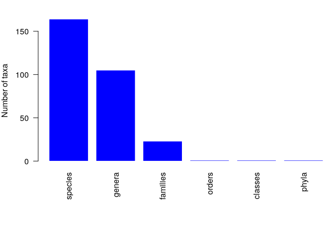
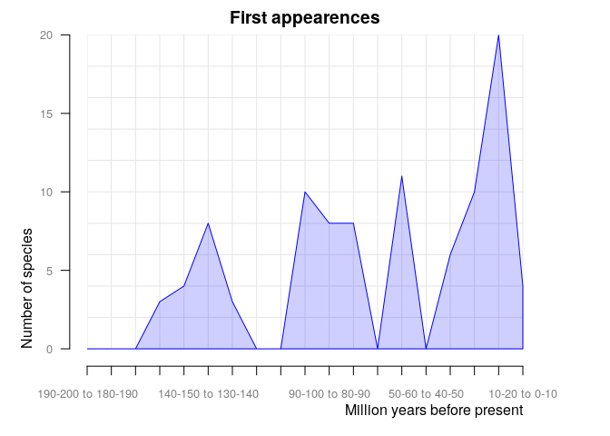
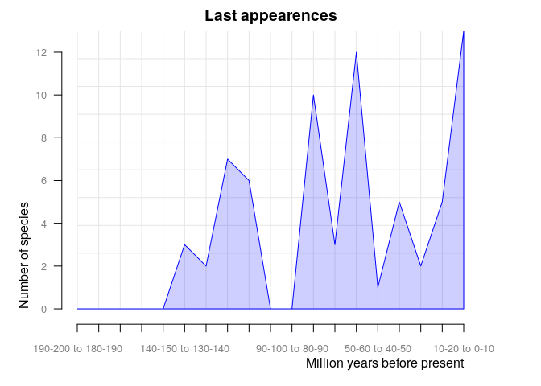
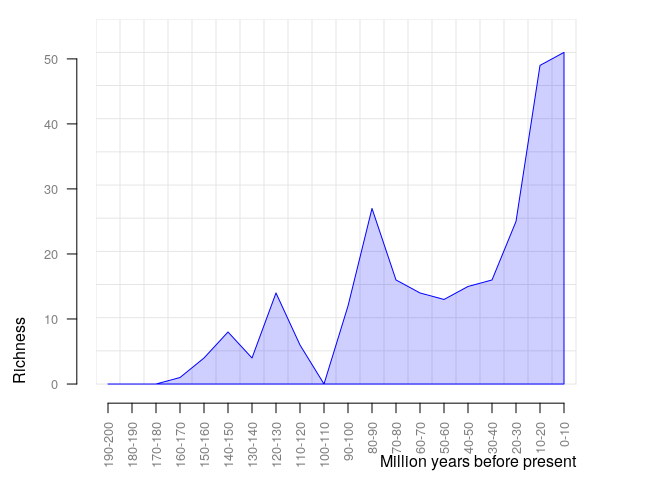
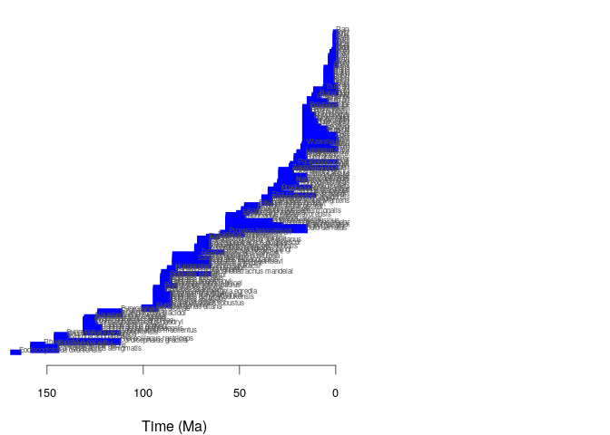

    #install.packages("paleobioDB")
    library(paleobioDB)

    ## Loading required package: raster

    ## Loading required package: sp

    ## Loading required package: maps

    #install.packages("devtools")
    library(devtools)
    install_github("ropensci/paleobioDB")

    ## Skipping install of 'paleobioDB' from a github remote, the SHA1 (6fd8a94e) has not changed since last install.
    ##   Use `force = TRUE` to force installation

    library(paleobioDB)

Defining "Anura"= frogs:
========================

Give me a list of occurences and names:
=======================================

    frogs <-pbdb_occurrences (limit="all", vocab= "pbdb", base_name="Anura", show=c("coords", "phylo", "ident"))
    head(frogs)

    ##     occurrence_no record_type collection_no
    ## 1:1        137378  occurrence         11576
    ## 1:2        137379  occurrence         11576
    ## 1:3        137433  occurrence         11582
    ## 1:4        138862  occurrence         11806
    ## 1:5        138866  occurrence         22634
    ## 1:6        145954  occurrence         12816
    ##                                taxon_name taxon_rank taxon_no
    ## 1:1     Cretasalia n. gen. tsybini n. sp.    species   134552
    ## 1:2                Gobiates leptocolaptus    species    58445
    ## 1:3 Gobiates n. gen. khermeentsavi n. sp.    species   156388
    ## 1:4                          Anura indet.      order    37422
    ## 1:5                        Pipidae indet.     family    37435
    ## 1:6  Enneabatrachus n. gen. hechti n. sp.    species    53192
    ##               matched_name matched_rank matched_no early_interval
    ## 1:1     Cretasalia tsybini      species     134552      Campanian
    ## 1:2 Gobiates leptocolaptus      species      58445      Campanian
    ## 1:3 Gobiates khermeentsavi      species     156388      Campanian
    ## 1:4                  Anura        order     150288     Berriasian
    ## 1:5                Pipidae       family      37435     Berriasian
    ## 1:6  Enneabatrachus hechti      species      53192   Kimmeridgian
    ##     late_interval early_age late_age reference_no        lng      lat
    ## 1:1 Maastrichtian      83.6     66.0    4173;4173   99.60000 43.30000
    ## 1:2 Maastrichtian      83.6     66.0    4173;4173   99.60000 43.30000
    ## 1:3 Maastrichtian      83.6     66.0  30994;30994   99.60000 43.30000
    ## 1:4   Valanginian     145.0    132.9    4203;4203   35.20000 31.00000
    ## 1:5        Aptian     145.0    113.0    4203;4203   34.72666 30.53889
    ## 1:6     Tithonian     157.3    145.0    4280;4280 -106.00222 41.89305
    ##              genus genus_no         family family_no order order_no
    ## 1:1     Cretasalia    86719     Gobiatidae     86720 Anura    97112
    ## 1:2       Gobiates    37429     Gobiatidae     86720 Anura    97112
    ## 1:3       Gobiates    37429     Gobiatidae     86720 Anura    97112
    ## 1:4           <NA>       NA           <NA>        NA Anura    97112
    ## 1:5           <NA>       NA        Pipidae     37435 Anura    97112
    ## 1:6 Enneabatrachus    53191 Discoglossidae     37426 Anura    97112
    ##        class class_no   phylum phylum_no     genus_name genus_reso
    ## 1:1 Amphibia    36319 Chordata     33815     Cretasalia    n. gen.
    ## 1:2 Amphibia    36319 Chordata     33815       Gobiates       <NA>
    ## 1:3 Amphibia    36319 Chordata     33815       Gobiates    n. gen.
    ## 1:4 Amphibia    36319 Chordata     33815          Anura       <NA>
    ## 1:5 Amphibia    36319 Chordata     33815        Pipidae       <NA>
    ## 1:6 Amphibia    36319 Chordata     33815 Enneabatrachus    n. gen.
    ##      species_name species_reso reid_no subgenus_name subgenus_reso
    ## 1:1       tsybini       n. sp.      NA          <NA>          <NA>
    ## 1:2 leptocolaptus         <NA>      NA          <NA>          <NA>
    ## 1:3 khermeentsavi       n. sp.      NA          <NA>          <NA>
    ## 1:4        indet.         <NA>      NA          <NA>          <NA>
    ## 1:5        indet.         <NA>      NA          <NA>          <NA>
    ## 1:6        hechti       n. sp.      NA          <NA>          <NA>

This provides me with the number of species my dataset has
==========================================================

This also helps me make sure that my dataset is large enough(&gt;100):
======================================================================

    pbdb_subtaxa (frogs, do.plot=TRUE)  

    ##   species genera families orders classes phyla
    ## 1     164    105       23      1       1     1

Plot with the number of new appearances and last appearances of species, genera, families, etc. in your query across the time:
==============================================================================================================================

    pbdb_orig_ext (frogs, rank="species", orig_ext=1, temporal_extent=c(0,200), res=10)

    ##                    new ext
    ## 10-20 to 0-10        4  13
    ## 20-30 to 10-20      20   5
    ## 30-40 to 20-30      10   2
    ## 40-50 to 30-40       6   5
    ## 50-60 to 40-50       0   1
    ## 60-70 to 50-60      11  12
    ## 70-80 to 60-70       0   3
    ## 80-90 to 70-80       8  10
    ## 90-100 to 80-90      8   0
    ## 100-110 to 90-100   10   0
    ## 110-120 to 100-110   0   6
    ## 120-130 to 110-120   0   7
    ## 130-140 to 120-130   3   2
    ## 140-150 to 130-140   8   3
    ## 150-160 to 140-150   4   0
    ## 160-170 to 150-160   3   0
    ## 170-180 to 160-170   0   0
    ## 180-190 to 170-180   0   0
    ## 190-200 to 180-190   0   0

    # extinction rates= orig_ext=2
    pbdb_orig_ext(frogs, rank="species", orig_ext=2, temporal_extent=c(0,200), res=10)

    ##                    new ext
    ## 10-20 to 0-10        4  13
    ## 20-30 to 10-20      20   5
    ## 30-40 to 20-30      10   2
    ## 40-50 to 30-40       6   5
    ## 50-60 to 40-50       0   1
    ## 60-70 to 50-60      11  12
    ## 70-80 to 60-70       0   3
    ## 80-90 to 70-80       8  10
    ## 90-100 to 80-90      8   0
    ## 100-110 to 90-100   10   0
    ## 110-120 to 100-110   0   6
    ## 120-130 to 110-120   0   7
    ## 130-140 to 120-130   3   2
    ## 140-150 to 130-140   8   3
    ## 150-160 to 140-150   4   0
    ## 160-170 to 150-160   3   0
    ## 170-180 to 160-170   0   0
    ## 180-190 to 170-180   0   0
    ## 190-200 to 180-190   0   0

To combine things, this plots dataset species richness:a dataframe and a plot with the number of species (or genera, families, etc.) across time:
=================================================================================================================================================

    pbdb_richness (frogs, rank="species", temporal_extent=c(0,200), res=10)

    ##    temporal_intervals richness
    ## 1                0-10       51
    ## 2               10-20       49
    ## 3               20-30       25
    ## 4               30-40       16
    ## 5               40-50       15
    ## 6               50-60       13
    ## 7               60-70       14
    ## 8               70-80       16
    ## 9               80-90       27
    ## 10             90-100       12
    ## 11            100-110        0
    ## 12            110-120        6
    ## 13            120-130       14
    ## 14            130-140        4
    ## 15            140-150        8
    ## 16            150-160        4
    ## 17            160-170        1
    ## 18            170-180        0
    ## 19            180-190        0
    ## 20            190-200        0

Finally, plot with the time span of the species:
================================================

     pbdb_temp_range (frogs, rank="species")

    ##                                        max      min
    ## Eodiscoglossus oxoniensis         167.7000 164.7000
    ## Comobatrachus aenigmatis          157.3000 145.0000
    ## Enneabatrachus hechti             157.3000 145.0000
    ## Eobatrachus agilis                157.3000 145.0000
    ## Rhadinosteus parvus               157.3000 152.1000
    ## Cordicephalus gracilis            145.0000 113.0000
    ## Thoraciliacus rostriceps          145.0000 113.0000
    ## Aygroua anoualensis               145.0000 139.8000
    ## Shomronella jordanica             145.0000 139.8000
    ## Sunnybatrachus purbeckensis       145.0000 140.2000
    ## Liaobatrachus macilentus          130.0000 113.0000
    ## Liaobatrachus beipiaoensis        130.0000 122.4600
    ## Liaobatrachus grabaui             130.0000 122.4600
    ## Liaobatrachus zhaoi               130.0000 122.4600
    ## Montsechobatrachus gaudryi        130.0000 125.0000
    ## Eodiscoglossus santonjae          130.0000 125.4500
    ## Gracilibatrachus avallei          130.0000 125.4500
    ## Iberobatrachus angelae            130.0000 125.4500
    ## Neusibatrachus wilferti           129.4000 125.0000
    ## Arariphrynus placidoi             122.4600 112.0300
    ## Cratia gracilis                   122.4600 112.0300
    ## Eurycephalella alcinae            122.4600 112.0300
    ## Avitabatrachus uliana              99.6000  93.5000
    ## Oumtkoutia anae                    99.6000  93.5000
    ## Aralobatrachus robustus            93.5000  86.3000
    ## Estesina elegans                   93.5000  86.3000
    ## Gobiates asiaticus                 93.5000  86.3000
    ## Gobiates dzhyrakudukensis          93.5000  86.3000
    ## Gobiates kizylkumensis             93.5000  86.3000
    ## Kizylkuma antiqua                  93.5000  86.3000
    ## Saevesoederberghia egredia         93.5000  86.3000
    ## Gobiates tatarinovi                93.5000  89.3000
    ## Gobiatoides parvus                 93.5000  89.3000
    ## Procerobatrachus paulus            93.5000  89.3000
    ## Baurubatrachus pricei              89.8000  83.6000
    ## Gobiates bogatchovi                89.8000  86.3000
    ## Gobiates fritschi                  89.8000  86.3000
    ## Gobiates furcatus                  89.8000  86.3000
    ## Gobiates sosedkoi                  89.8000  86.3000
    ## Gobiates spinari                   89.8000  86.3000
    ## Vulcanobatrachus mandelai          89.3000  66.0000
    ## Pachycentrata taqueti              89.3000  83.6000
    ## Bakonybatrachus fedori             86.3000  83.6000
    ## Hungarobatrachus szukacsi          86.3000  83.6000
    ## Cretasalia tsybini                 83.6000  66.0000
    ## Gobiates khermeentsavi             83.6000  66.0000
    ## Gobiates leptocolaptus             83.6000  66.0000
    ## Saltenia ibanezi                   83.6000  72.1000
    ## Scotiophryne pustulosa             83.5000  66.0000
    ## Hensonbatrachus kermiti            83.5000  70.6000
    ## Tyrrellbatrachus brinkmani         83.5000  70.6000
    ## Eoxenopoides reuningi              72.1000  59.2000
    ## Beelzebufo ampinga                 72.1000  66.0000
    ## Palaeobatrachus occidentalis       72.1000  66.0000
    ## Uberabatrachus carvalhoi           72.1000  66.0000
    ## Hatzegobatrachus grigorescui       70.6000  66.0000
    ## Paradiscoglossus americanus        70.6000  66.0000
    ## Paralatonia transylvanica          70.6000  66.0000
    ## Theatonius lancensis               70.6000  66.0000
    ## Estesiella boliviensis             66.0000  61.6000
    ## Xenopus romeri                     58.7000  48.6000
    ## Prospea holoserisca                58.7000  55.8000
    ## Bufo serratus                      56.0000  15.9700
    ## Rana plicata                       56.0000  15.9700
    ## Thaumastosaurus bottii             56.0000  15.9700
    ## Llankibatrachus truebae            56.0000  28.4000
    ## Indobatrachus pusillus             56.0000  33.9000
    ## Shelania laurenti                  56.0000  33.9000
    ## Lechriodus casca                   56.0000  47.8000
    ## Eophractus casamayorensis          55.8000  48.0000
    ## Eorubeta nevadensis                55.8000  48.6000
    ## Eorhinophrynus septentrionalis     50.3000  46.2000
    ## Shelania pascuali                  47.8000  41.3000
    ## Singidella latecostata             47.8000  41.3000
    ## Chelomophrynus bayi                46.2000  40.4000
    ## Elkobatrachus brocki               46.2000  40.4000
    ## Albionbatrachus wightensis         37.2000  33.9000
    ## Eopelobates grandis                37.2000  33.9000
    ## Rhinophrynus canadensis            37.2000  33.9000
    ## Thaumastosaurus wardi              37.2000  33.9000
    ## Eopelobates bayeri                 33.9000  11.6200
    ## Xenopus arabiensis                 33.9000  23.0300
    ## Macropelobates osborni             33.9000  28.4000
    ## Prodiscoglossus vertaizoni         33.9000  28.4000
    ## Spea neuter                        30.8000  13.6000
    ## Tephrodytes brassicarvalis         30.8000  20.4300
    ## Calyptocephalella canqueli         29.0000  21.0000
    ## Neoprocoela edentatus              29.0000  21.0000
    ## Australobatrachus ilius            28.4000  15.9700
    ## Limnodynastes archeri              28.4000  15.9700
    ## Litoria caerulea                   28.4000  15.9700
    ## Eopelobates anthracinus            28.4000  23.0300
    ## Hyla europaea                      28.4000  23.0300
    ## Zaphrissa eurypelis                28.4000  23.0300
    ## Rana pipiens                       23.0300   0.0117
    ## Latonia ragei                      23.0300  13.6500
    ## Palaeobatrachus robustus           22.4000  20.0000
    ## Scaphiopus (Scaphiopus) holbrooki  20.4300   0.0117
    ## Bufo praevius                      20.4300  15.9700
    ## Hyla goini                         20.4300  15.9700
    ## Proacris mintoni                   20.4300  15.9700
    ## Leiopelma acricarina               19.0000  15.9000
    ## Leiopelma miocaenale               19.0000  15.9000
    ## Bufo viridis                       16.9000   0.0000
    ## Pelophylax ridibunda               16.9000   0.0117
    ## Latonia gigantea                   16.9000   3.6000
    ## Wawelia gerholdi                   16.3000  15.5000
    ## Acris crepitans                    15.9700   0.0117
    ## Hyla gratiosa                      15.9700   0.0117
    ## Spea bombifrons                    15.9700   0.0117
    ## Hyla versicolor                    15.9700   0.3000
    ## Pseudacris clarki                  15.9700   0.3000
    ## Bufo hibbardi                      15.9700   4.9000
    ## Scaphiopus (Scaphiopus) wardorum   15.9700   4.9000
    ## Lechriodus intergerivus            15.9700   5.3330
    ## Latonia seyfriedi                  15.9700   8.7000
    ## Bufo valentinensis                 15.9700  10.3000
    ## Hyla squirella                     15.9700  10.3000
    ## Scaphiopus (Spea) alexanderi       15.9700  10.3000
    ## Bufo linquensis                    15.9700  11.6080
    ## Miopelodytes gilmorei              15.9700  11.6080
    ## Rana basaltica                     15.9700  11.6080
    ## Bufo kuhrei                        15.9700  13.6000
    ## Hyla miocenica                     15.9700  13.6000
    ## Pseudacris nordensis               15.9700  13.6000
    ## Pelobates fahlbuschi               15.9700  13.6500
    ## Hyla cinerea                       13.6000   0.0117
    ## Bufo pliocompactilis               13.6000   4.9000
    ## Bufo tiheni                        13.6000   4.9000
    ## Rana johnsoni                      13.6000  10.3000
    ## Rana pueyoi                        11.1000   8.7000
    ## Rana quellembergi                  11.1000   8.7000
    ## Bufo woodhousei                    10.3000   0.0000
    ## Rana catesbeiana                   10.3000   0.0117
    ## Bufo holmani                       10.3000   4.9000
    ## Rana temporaria                     5.3330   0.0117
    ## Gastrophryne carolinensis           4.9000   0.0117
    ## Anchylorana dubita                  4.9000   1.8000
    ## Anchylorana moorei                  4.9000   1.8000
    ## Anchylorana robustocondyla          4.9000   1.8000
    ## Bufo defensor                       4.9000   1.8000
    ## Rana bucella                        4.9000   1.8000
    ## Rana fayeae                         4.9000   1.8000
    ## Rana parvissima                     4.9000   1.8000
    ## Rana rexroadensis                   4.9000   1.8000
    ## Spea diversus                       4.9000   1.8000
    ## Bufo americanus                     2.5880   0.0117
    ## Geocrinia laevis                    2.5880   0.0117
    ## Limnodynastes dumerili              2.5880   0.0117
    ## Limnodynastes tasmaniensis          2.5880   0.0117
    ## Litoria ewingi                      2.5880   0.0117
    ## Ranidella signifera                 2.5880   0.0117
    ## Bufo terrestris                     1.8000   0.0117
    ## Pseudacris triseriata               1.8000   0.0117
    ## Odontophrynus americanus            0.7810   0.1260
    ## Hyla barbudensis                    0.1260   0.0000
    ## Scaphiopus (Scaphiopus) couchi      0.1260   0.0000
    ## Spea hammondii                      0.1260   0.0000
    ## Acris gryllus                       0.1260   0.0117
    ## Hyla baderi                         0.1260   0.0117
    ## Pseudacris ornata                   0.1260   0.0117
    ## Rhinophrynus dorsalis               0.1260   0.0117
    ## Syrrhophus marnocki                 0.1260   0.0117
    ## Rana dalmatina                      0.0117   0.0000
